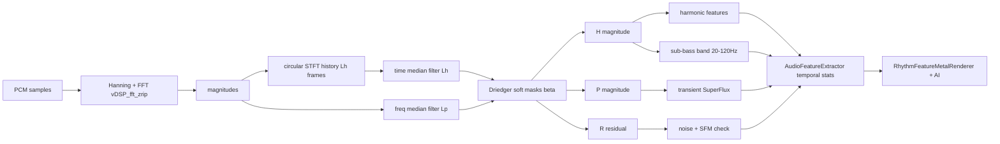

## 背景与文献依据

当前 DSP 的频段切分按 bin 索引硬切（`bassEnd = 250/binWidth`），与 80 log-spaced band 输出口径不一致；瞬态用 spectral flux 但不区分 P/H/R；谐波/噪声完全未拆分。文献给出可在 iOS 实时实现的明确方法：

- **FitzGerald 2010**（DAFx）：在 STFT 功率谱上做横向中值滤波（沿时间）→ 谐波，纵向中值滤波（沿频率）→ 瞬态。`L^h ≈ 17`、`L^p ≈ 17` 是常用起点。
- **Driedger 2014**（ISMIR）：在 H/P 之外引入残差 R，soft mask 用分离因子 β（≥1）控制何为"明确谐波/明确瞬态"，剩下归 R = noise/FX。`S = H + P + R`。
- **Böck 2013 SuperFlux**：对 P 通道再做"max-filter 抑制颤音 + 半波整流"得到瞬态强度，比传统 spectral flux 减少假阳性。
- **谱平坦度 SFM**（Geometric/Arithmetic Mean）：交叉验证 noise/FX；接近 1 = 噪声，接近 0 = 谐波。
- **频段定义**：Sub-Bass 20–60 Hz、Bass 60–120 Hz 取自常用音频工程划分；FFT 频率分辨率受限于 N/Fs，下面会调整 FFT 大小。

---

## 架构总览



---

## 关键设计决策

### 1) FFT 配置升级
- 现 FFT = 2048 @ 44.1 kHz → 频率分辨率 ≈ 21.5 Hz，无法准确分辨 20 Hz sub-bass。
- 升至 **FFT = 4096**（分辨率 ≈ 10.77 Hz），hop = 2048（50% overlap）以保持 23 ms 帧率。
- 在 [`AudioSpectrumPlayer.m`](AudioSampleBuffer/AudioSampleBuffer/AudioSpectrumPlayer.m) 把 tap bufferSize 从 2048 升到 4096，或保留 2048 tap + 在 DSP 内做 4096 累积窗（更稳）。

### 2) HPSS 参数（移动端实时友好）
- `L^h = 11`（沿时间，约 11 帧 ≈ 250 ms 上下文，能捕捉 ≥4 Hz 调制）
- `L^p = 17`（沿频率，约 17 bin ≈ 180 Hz 局部宽度）
- `β = 1.8`（Driedger）：soft mask 阈值，决定 R 占比
- 中值滤波在 vDSP 没有原生支持 → 实现 O(L log L) 的 inplace 排序中值（L=11/17 时极快），或用快速近似（rolling histogram）

### 3) 四类特征定义（DSP 输出）

- **Sub-Bass 能量**：从 H 通道的 20–120 Hz 线性 bin 求和（拆 Sub 20–60 / Bass 60–120 两个子值）。用 H 而不是原始幅度，避免鼓击瞬态污染低频能量读数。
- **Transient 强度**：对 P 通道做 SuperFlux —— `flux = Σ max(P_t[k] − max_filter(P_{t-μ})[k], 0)`，其中 max_filter 取上下 ±3 bin、μ=2 帧。
- **Harmonic 强度**：H 通道的 (a) 总能量；(b) 谐波密度 = `H_peak_mean / H_full_mean`（峰均比，越高越"线条状"）；(c) 谐波质心。
- **Noise/FX 强度**：R 通道总能量 + 全频段 SFM；当 SFM > 0.4 且 R > 阈值时标记 noise burst（riser/sweep 检测）。

### 4) 接口扩展（hybrid 拆分）

DSP 层（`RealtimeAnalyzerDSP.c/.h`）新增：
```c
typedef struct {
    float subBass;        // 20-60 Hz, from H
    float bass;           // 60-120 Hz, from H
    float transient;      // SuperFlux on P
    float harmonic;       // H total + peak/mean
    float harmonicPeakRatio;
    float noise;          // R total
    float spectralFlatness;
} CategoryFeatures;

void AnalyzerDSP_ProcessChannelExtended(...,
    float *outBands,           // 既有 80 band（不变）
    float *outHBands,           // 新增：H 80 band
    float *outPBands,           // 新增：P 80 band
    float *outRBands,           // 新增：R 80 band
    CategoryFeatures *outCat);  // 新增：4 类标量
```

`AudioFeatureExtractor` 层（`AudioFeatures` 类）扩展属性：
```objc
@property (nonatomic, assign) float subBassEnergy;       // 20-120 Hz, H-channel
@property (nonatomic, assign) float transientStrength;   // SuperFlux normalized
@property (nonatomic, assign) float harmonicStrength;    // H peak/mean
@property (nonatomic, assign) float noiseStrength;       // R + SFM
@property (nonatomic, assign) BOOL  subBassHit;           // sub-bass spike onset
@property (nonatomic, assign) BOOL  transientHit;         // transient onset
@property (nonatomic, assign) BOOL  noiseFXActive;        // riser/sweep flag
```

### 5) 节拍/瞬态检测重写

- 现有 `detectBeat:` 依赖 80-band 前 12 个 band 的 bassEnergy spike：换为 `subBassHit` = 在 20–120 Hz H 通道 envelope 上做自适应阈值（Klapuri 2003 式）。
- 现有 `calculateSpectralFlux:` 替换为 P 通道 SuperFlux：滞后 μ=2 帧 + ±3 bin max filter，准确率提升明显，对 vibrato/legato 误检大幅下降。
- 节拍 = subBassHit ∨ (transientHit 且 P 在 60–250 Hz 占比高)：兼顾 kick 与 snare/hihat。

### 6) 性能预算
4096 FFT @ 50% overlap + 中值滤波（L^h=11, L^p=17, half=2048 bin）：

- 时间中值：2048 × O(11 log 11) ≈ 76k 操作/帧（10–11 帧 ring buffer）
- 频率中值：单帧 2048 × O(17 log 17) ≈ 142k 操作/帧
- 合计 < 0.5 ms @ 当代 iPhone（实测 SuperFlux 仅 ~50 µs）。
- 对比 Driedger 2014 报告的 SiTraNo CPU 实现 ~3× realtime，我们只算单帧故远低于实时上限。

---

## 主要修改文件

- [`AudioSampleBuffer/RealtimeAnalyzerDSP.h`](AudioSampleBuffer/AudioSampleBuffer/RealtimeAnalyzerDSP.h) / [`.c`](AudioSampleBuffer/AudioSampleBuffer/RealtimeAnalyzerDSP.c) — 新增 HPSS state、ring buffer、中值滤波、soft mask、4 类标量输出
- [`AudioSampleBuffer/RealtimeAnalyzer.h`](AudioSampleBuffer/AudioSampleBuffer/RealtimeAnalyzer.h) / [`.m`](AudioSampleBuffer/AudioSampleBuffer/RealtimeAnalyzer.m) — 扩展 `analyse:` 返回结构（兼容旧 NSArray 路径），FFT size 调整
- [`AudioSampleBuffer/AudioSpectrumPlayer.m`](AudioSampleBuffer/AudioSampleBuffer/AudioSpectrumPlayer.m) — tap bufferSize 与 delegate 协议
- [`AudioSampleBuffer/AI/AudioFeatureExtractor.h`](AudioSampleBuffer/AI/AudioFeatureExtractor.h) / [`.m`](AudioSampleBuffer/AI/AudioFeatureExtractor.m) — `AudioFeatures` 增 4 类字段；移除 NSArray boxing 路径，改吃 float pointer；重写 beat / flux 检测
- [`AudioSampleBuffer/ViewController+Library.m`](AudioSampleBuffer/ViewController+Library.m) — `bassEnergyFromSpectrum:` 与 `detectBeatFromSpectrum:` 改用新 `AudioFeatures.subBassHit/transientHit`
- [`AudioSampleBuffer/RhythmEffects/FeatureEffects/RhythmFeatureMetalRenderer.h`](AudioSampleBuffer/RhythmEffects/FeatureEffects/RhythmFeatureMetalRenderer.h) — 增加 `triggerWithCategoryFeatures:` 让 shader 区分 sub-bass / transient / noise burst 触发
- [`AudioSampleBuffer/VisualEffects/Metal/MetalRenderer.m`](AudioSampleBuffer/VisualEffects/Metal/MetalRenderer.m) — uniform 增加 `subBass/transient/harmonic/noise` 4 通道，shader 可按需要选择反应源
- [`AudioSampleBuffer/AI/MusicStyleClassifier.m`](AudioSampleBuffer/AI/MusicStyleClassifier.m) — 用更准的特征评分（鼓多 → percussive 高 → metal/electronic；harmonic 高 → classical/jazz；noise 高 → ambient/glitch）

---

## 验证方法

1. **单元 fixture**：对 castanets+violin 混音、kick drum loop、white noise sweep 三段离线分析输出 H/P/R 与 4 类标量，对比 librosa.hpss 参考。
2. **在线视觉验证**：在播放 EDM、纯人声 acapella、白噪音三类素材时，观察 RhythmFeatureMetalRenderer 触发是否分别落在 kick / harmonic stable / noise burst 上。
3. **CPU profiling**：Instruments Time Profiler 测每帧 DSP 用时 < 1 ms（4096 FFT + HPSS）。

---

## 参考文献
- D. FitzGerald, "Harmonic/Percussive Separation Using Median Filtering", DAFx 2010.
- J. Driedger, M. Müller, S. Disch, "Extending Harmonic-Percussive Separation of Audio Signals", ISMIR 2014.
- S. Böck, G. Widmer, "Maximum Filter Vibrato Suppression for Onset Detection" (SuperFlux), DAFx 2013.
- L. Fierro, V. Välimäki, "SiTraNo: A MATLAB App for Sines-Transients-Noise Decomposition", DAFx 2021；Aalto Enhanced Fuzzy Decomposition 2022。
- Frontiers in Signal Processing, "Sines, transient, noise neural modeling of piano notes", 2024.
- Glasberg & Moore 1990 ERB scale；ISO 226 (A-weighting)。